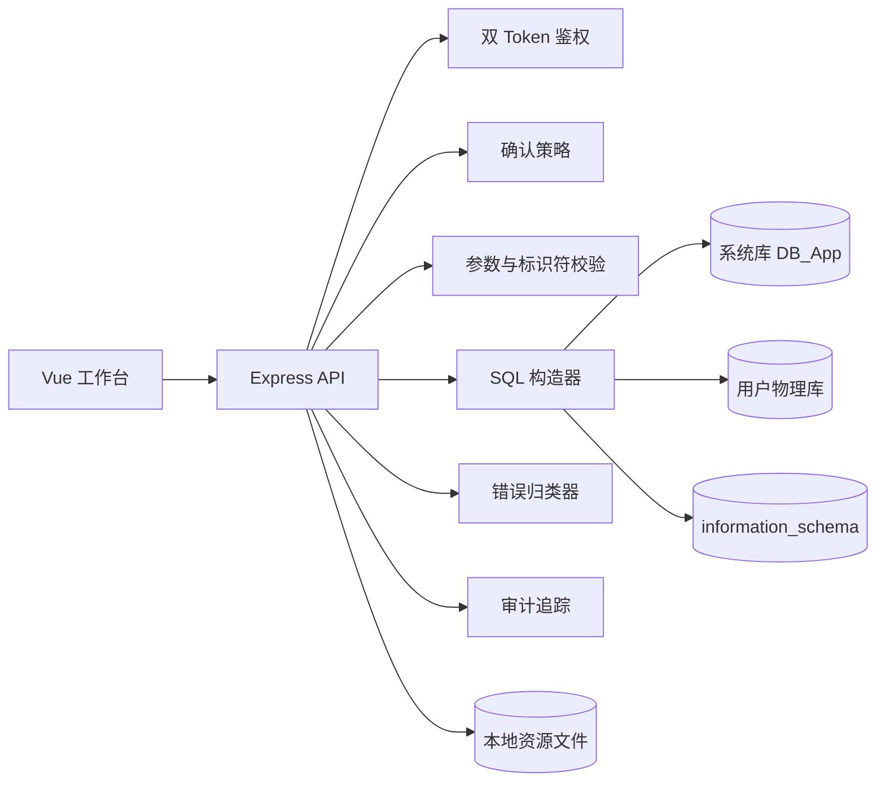

# 概要设计

## 1. 系统定位

系统定位为本地 MySQL 可视化 DBMS 工作台。用户通过个人账号登录后，在统一风格的工作台中完成数据库、表、字段、索引、约束、视图、数据、事务和统计的 GUI 操作。

前端负责交互体验和结构化请求生成。后端负责鉴权、授权、校验、SQL 构造、执行、错误归类、确认策略和审计追踪。MySQL 负责真实数据存储和执行。

## 2. 架构总览



## 3. 模块划分

| 模块 | 职责 |
| --- | --- |
| 认证模块 | 注册、登录、刷新会话、退出登录、双 Token 管理 |
| 工作台模块 | 首页概览、数据库树、主色调控制、快捷入口 |
| 用户模块 | 用户资料、偏好设置、确认偏好 |
| 资源模块 | 用户资源元信息、本地文件路径管理 |
| 数据库模块 | 数据库创建、重命名、字符集修改、删除、统计 |
| 表结构模块 | 表创建、表结构查看、字段增删改、表删除 |
| 约束模块 | 主键、外键、唯一约束、检查约束、默认值、非空约束 |
| 索引模块 | 普通索引、唯一索引、复合索引、索引删除 |
| 视图模块 | GUI 查询定义视图、视图查看、视图修改、视图删除 |
| 数据模块 | 表数据浏览、新增、修改、删除、批量操作 |
| GUI 查询模块 | 字段选择、条件组、排序、分页、聚合、分组、连接查询 |
| 事务模块 | 开启事务、事务内操作、提交、回滚、超时释放 |
| 统计模块 | 用户级、数据库级、表级统计 |
| 错误模块 | 网络错误、服务错误、业务错误、数据库错误统一归类 |
| 审计模块 | 操作记录、失败记录、traceId 追踪 |

## 4. 前端概要设计

### 4.1 页面结构

```txt
frontend/src/
  views/
    Login.vue
    Register.vue
    Home.vue
    DatabaseDashboard.vue
    TableDesigner.vue
    ConstraintDesigner.vue
    IndexDesigner.vue
    ViewDesigner.vue
    DataBrowser.vue
    QueryBuilder.vue
    TransactionPanel.vue

  components/
    ParticleBackground.vue
    AppHeader.vue
    ThemeHueSlider.vue
    DbTree.vue
    GlassPanel.vue
    ConfirmDialog.vue
    DataGrid.vue
    ColumnEditor.vue
    ConstraintEditor.vue
    IndexEditor.vue
    QueryConditionBuilder.vue
    ChartCard.vue
```

### 4.2 工作台布局

| 区域 | 内容 |
| --- | --- |
| 顶部栏 | 系统名称、主色调控制、用户信息、退出 |
| 左侧数据库导航树 | database、tables、views、indexes |
| 右侧工作区 | 用户概览、数据库看板、表设计器、数据浏览、查询构造、事务面板 |

工作台采用固定经典布局。主色调控制条直接更新用户偏好和页面 CSS 变量。视觉风格使用粒子背景、毛玻璃面板和动态主题色。

### 4.3 数据库导航树

数据库导航树展示：

```txt
database
  tables
    table_a
  views
    view_a
```

点击数据库进入数据库看板。点击表进入数据浏览页。点击视图进入视图数据页和视图定义页。

### 4.4 表设计器

表设计器包含：

- 字段列表。
- 字段类型编辑。
- 长度、精度、小数位编辑。
- 默认值编辑。
- 非空约束编辑。
- 主键编辑。
- 外键编辑。
- 唯一约束编辑。
- 检查约束编辑。
- 索引编辑入口。
- 结构变更影响分析。

### 4.5 数据浏览器

数据浏览器包含：

- 分页表格。
- 单行新增。
- 批量新增。
- 单行修改。
- 批量修改。
- 单行删除。
- 批量删除。
- 行内编辑草稿态。
- 行级更新按钮。
- 行级取消修改按钮。
- 字段筛选。
- 排序。
- 级联影响提示。
- 精确错误展示。

数据浏览器采用“先编辑、后提交”的交互模型。用户直接在表格单元格中修改内容时，前端只记录本地草稿并标记该行为待更新。只有用户点击该行旁边的“更新/提交”按钮后，前端才向后端提交变更；点击“取消”则丢弃草稿并恢复为服务端数据。

行内编辑优先依赖主键定位目标行。无主键表可以浏览、筛选和新增，但默认禁止行内编辑和单行删除；如后续支持无主键行编辑，必须由后端提供稳定行定位策略并明确风险提示。

V5 阶段已落地分页预览、字段筛选、列显示控制、排序、单行新增、批量新增、基于主键的单行更新、基于主键列表的批量修改、基于主键的单行删除和基于主键列表的批量删除。批量写入接口通过事务保证同一批次全成功或全回滚。级联影响分析和完整审计属于后续统计与审计阶段。

### 4.6 GUI 查询构造器

GUI 查询构造器提交结构化 JSON。它覆盖：

- 选择字段。
- 字段别名。
- 条件组。
- 逻辑组合。
- 排序。
- 分页。
- 聚合函数。
- 分组。
- HAVING。
- 多表 JOIN。
- 派生表子查询。
- `IN` / `NOT IN` 子查询。
- `EXISTS` / `NOT EXISTS` 子查询。
- 标量子查询。

后端将结构化 JSON 转为安全 `SELECT` SQL。查询构造器不直接提交原始 SQL 字符串，而是提交受控查询 AST。AST 中的主表、JOIN 表、派生表、子查询、字段、排序字段和条件字段均由后端校验后生成 SQL。

复杂查询必须受容量限制约束，包括最大 JOIN 数、最大子查询深度、最大返回字段数、最大返回行数和最大执行时间。

### 4.7 事务面板

事务面板展示：

- 当前事务 ID。
- 当前隔离级别。
- 事务开始时间。
- 事务超时时间。
- 已执行操作列表。
- 提交按钮。
- 回滚按钮。

事务内的数据修改请求必须携带 `transactionId`。

## 5. 后端概要设计

### 5.1 目录结构

```txt
backend/src/
  config/
    env.ts
    db.ts

  middlewares/
    authMiddleware.ts
    requestIdMiddleware.ts
    errorMiddleware.ts
    rateLimitMiddleware.ts

  routes/
    authRoutes.ts
    userRoutes.ts
    preferenceRoutes.ts
    databaseRoutes.ts
    tableRoutes.ts
    constraintRoutes.ts
    indexRoutes.ts
    viewRoutes.ts
    rowRoutes.ts
    queryRoutes.ts
    transactionRoutes.ts
    statsRoutes.ts
    auditRoutes.ts

  controllers/
    authController.ts
    userController.ts
    preferenceController.ts
    databaseController.ts
    tableController.ts
    constraintController.ts
    indexController.ts
    viewController.ts
    rowController.ts
    queryController.ts
    transactionController.ts
    statsController.ts
    auditController.ts

  services/
    authService.ts
    tokenService.ts
    userService.ts
    preferenceService.ts
    databaseService.ts
    tableService.ts
    constraintService.ts
    indexService.ts
    viewService.ts
    rowService.ts
    queryService.ts
    transactionService.ts
    statsService.ts
    auditService.ts
    assetService.ts

  utils/
    response.ts
    errors.ts
    sqlIdentifier.ts
    sqlBuilder.ts
    mysqlErrorMapper.ts
    validators.ts
```

### 5.2 请求处理链路

```txt
request
  -> requestIdMiddleware
  -> authMiddleware
  -> controller
  -> validator
  -> permission check
  -> confirmation policy
  -> service
  -> SQL builder
  -> MySQL
  -> error mapper
  -> audit log
  -> response
```

### 5.3 权限模型

系统采用用户所有权模型：

```txt
currentUserId + databaseId -> user_databases.active
```

所有数据库对象操作都必须先完成数据库归属校验。表、索引、约束、视图、数据、事务均继承数据库归属权限。

### 5.4 SQL 构造

SQL 构造器统一负责：

- 数据库名反引号封装。
- 表名反引号封装。
- 字段名反引号封装。
- 字段类型白名单。
- 操作符白名单。
- 值参数化。
- 分页限制。
- 批量操作限制。

## 6. 错误处理概要

系统采用统一错误模型：

```txt
NETWORK_ERROR
HTTP_TIMEOUT
AUTH_ERROR
AUTHZ_ERROR
VALIDATION_ERROR
CONFIRMATION_REQUIRED
LIMIT_EXCEEDED
MYSQL_CONNECTION_ERROR
MYSQL_EXECUTION_ERROR
MYSQL_CONSTRAINT_ERROR
INTERNAL_ERROR
```

后端错误响应必须包含：

- `traceId`
- `errorType`
- `errorCode`
- `message`
- `details`
- `fieldErrors`
- `mysql`

前端根据 `errorType` 和 `errorCode` 展示精准提示。

## 7. 二次确认概要

确认策略由后端判断，前端负责展示。确认策略分为：

| 风险级别 | 操作 | 确认规则 |
| --- | --- | --- |
| 强制确认 | 删除数据库、删除表、删除字段 | 必须输入对象名 |
| 强制确认 | 触发外键级联删除 | 必须展示影响分析并确认 |
| 偏好确认 | 批量修改、批量删除、批量插入 | 达到阈值时弹窗确认 |
| 普通操作 | 单行新增、普通查询、查看统计 | 不弹窗 |

偏好确认类别支持用户关闭。强制确认类别不支持关闭。

## 8. 事务概要

事务由后端维护事务会话：

```txt
POST /transactions
  -> 创建连接
  -> 设置隔离级别
  -> BEGIN
  -> 返回 transactionId
```

事务会话具备固定超时时间。超时后系统自动回滚并释放连接。

事务内写操作必须携带 `transactionId`。提交和回滚必须由创建事务的用户发起。

## 9. 数据统计概要

统计来源：

- 系统库 `audit_logs`。
- MySQL `information_schema.tables`。
- MySQL `information_schema.columns`。
- 用户物理库中的表数据聚合查询。

统计接口同样执行数据库归属校验。表级统计涉及字段聚合时，字段名必须来自上方列出的 MySQL 元数据来源。

## 10. 资源存储概要

用户资源实体保存到本地文件存储。系统库保存资源元信息：

- 资源 ID。
- 用户 ID。
- 资源类型。
- 存储类型。
- 存储键。
- MIME 类型。
- 文件大小。
- 校验和。

资源读取、替换、删除均执行归属校验。

## 11. 容量限制概要

系统容量限制由服务端统一配置，不由前端决定。前端只展示限制提示和当前使用量。

默认限制建议：

| 限制项 | 默认值 | 说明 |
| --- | --- | --- |
| 单用户数据库数量 | 10 | 超过后禁止继续创建 |
| 单数据库表数量 | 100 | 不含视图 |
| 单数据库视图数量 | 50 | 视图定义来自受控查询构造器 |
| 单表字段数量 | 80 | 超过后禁止新增字段 |
| 单表索引数量 | 16 | 不含 MySQL 自动创建索引 |
| 单用户物理数据总量 | 1GB | 基于 information_schema 估算 |
| 单数据库物理数据量 | 512MB | 数据大小 + 索引大小 |
| 单表物理数据量 | 256MB | 数据大小 + 索引大小 |
| 单次分页返回行数 | 100 | pageSize 最大值 |
| 单次查询最大扫描结果 | 1000 行 | 查询接口服务端硬限制 |
| 单次批量插入行数 | 500 | 超过拒绝 |
| 单次批量修改影响行数 | 200 | 超过要求确认或拒绝 |
| 单次批量删除影响行数 | 200 | 超过要求确认或拒绝 |
| 查询最大 JOIN 数 | 8 | 包含普通表和视图 |
| 查询最大子查询深度 | 3 | 防止过复杂查询 |
| 查询最大执行时间 | 10 秒 | 超时中断 |
| 查询 AST 最大体积 | 64KB | 请求体限制 |
| 头像文件大小 | 2MB | 只允许 png、jpeg、webp |
| 背景图文件大小 | 8MB | 只允许 png、jpeg、webp |
| 单用户资源总量 | 100MB | 头像、背景等资源合计 |

以上默认值用于本地课程项目落地，后续可以通过环境变量或服务端配置文件调整。所有限制必须在后端二次校验，不能只依赖前端校验。
